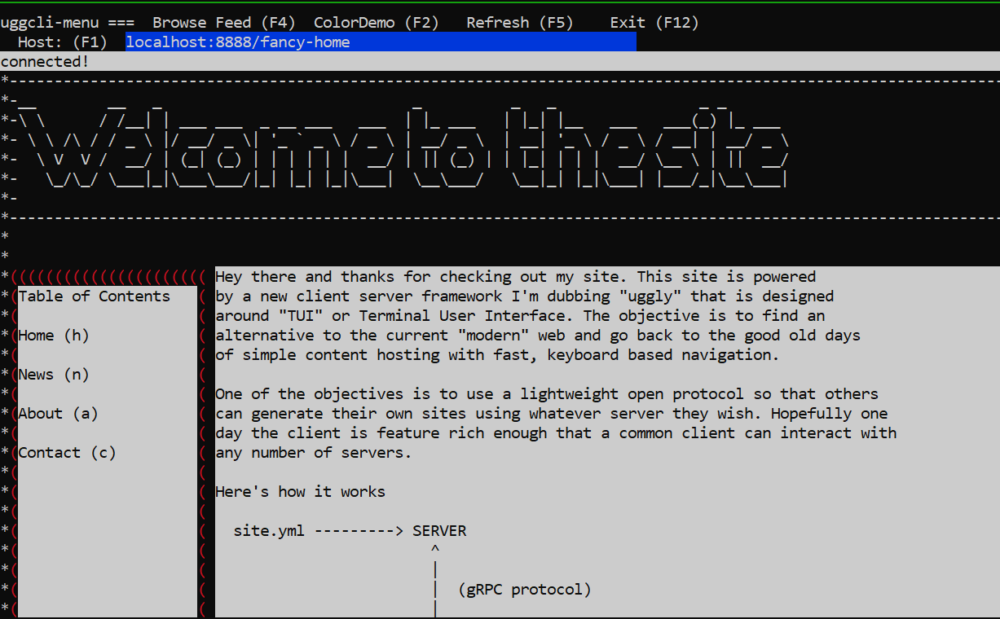

# uggly-server
Uggly is a means to generate Terminal User Interfaces in a client-server architecture. Think of it as TUI over-the-wire (TUIOW). The client requests content from the server via gRPC protobuffers and the client handles rendering of that content. The server is sending "pages" of content one screen at a time. The protocol and page definitions take inspiration from CSS/HTML in that there are constructs such as DivBoxes, TextBlobs, Links, and Forms for example. It is opinionated in that only keyboard strokes are supported for link navigation.

# Overview
This project is a sample server designed to be easy to use for people unfamiliar with the project to serve content using the uggly protocol to an existing [client](http://github.com/rendicott/uggly-client).

While the real power of using the [uggly protocol](https://github.com/rendicott/uggly) is in generating content dynamically, this is a steeper learning curve for people trying to just generate some "hello world" content. Therefore, this server exists to bridge the understanding for people who are already familiar with concepts such as an Apache server that serves static HTML files. 

Similar to Apache, this server takes a file parameter for a YML file that contains static content that the server should serve. 

# Usage
1. Download one of the release binaries and then extract to a directory. There should be binary such as `ugglys`.
2. Next you'll need to locate or generate a YML file with some content. There is a fairly complex example in this repo called `pages.yml` which you'll want to put somewhere on disk so you can pass it in as a param. 
3. Run the server with the command `./ugglys -port 8888 -pages pages.yml`
4. If you haven't already, make sure you download the [client](http://github.com/rendicott/uggly-client)
5. Start the client with the command `./ugglyc -server localhost -port 8888 -page fancy-home`
6. You should see the pages rendered as in the following screenshot
  * 
7. Navigate the site using the keyboard (e.g., press `a` to go to the about page.)

# Creating Content
Check out `hello-world.yml` and `wrap.yml` for some more basic examples. Modifying the file that the server started with will trigger a re-serve of the content. You'll have to hit refresh (F5) on the client.

The server tries to parse the file into structs that map very closely to the uggly protocol structs but it doesn't support all of them. For, example, Forms would be tricky in a static file because there would be no way to define a handler for the submission.

However, you should be able to play around with DivBox, TextBlob, and Links to get a feel for the capabilities of the visualizations.  
